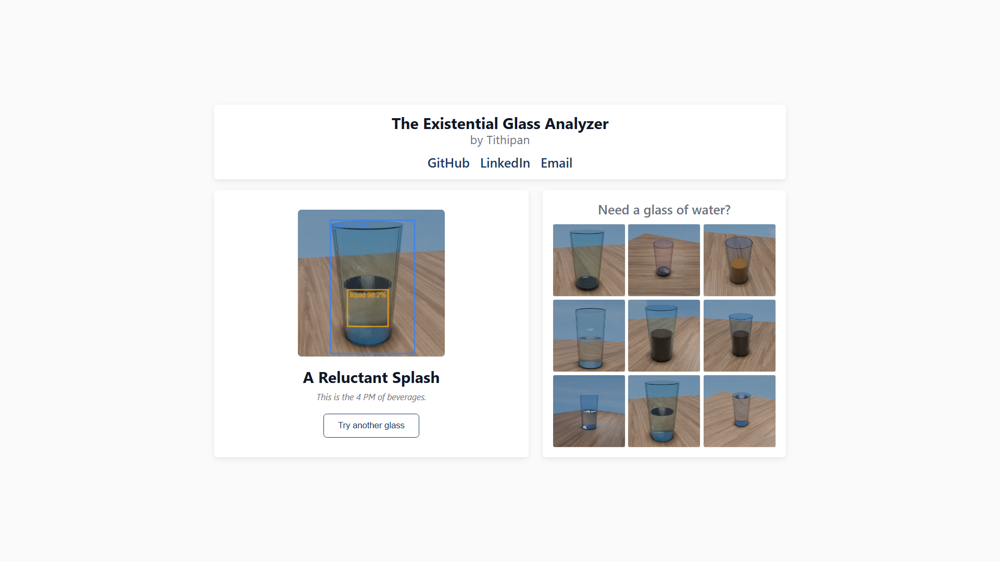

# The Existential Glass Analyzer

**Is your glass half full or half empty?** A browser-based AI that answers
life's most pointless question with shocking confidence.



Drop in a photo of a glass. A tiny neural network runs entirely in your browser
(via WebGPU) and renders a philosophical verdict. No servers, no API keys, no
privacy concerns — just a 6 MB model, a canvas overlay, and an opinion.

---

## Try It

[Here](https://ttithipan.github.io/GlassHalfFull/)

---

## How It Works

1. **Tiny detector** — MobileNetV3-Small backbone (1.66M params) trained on
   8,000 synthetic Blender images with perfect bounding-box labels.

2. **In-browser inference** — ONNX Runtime Web loads the model into a Web
   Worker. WebGPU-accelerated when available, WASM fallback.

3. **Philosophy engine** — Fill ratio = liquid height / glass height.
   Below 15%: void. Above 85%: hubris. The 40–60% zone flips a coin between
   "Half Full" and "Half Empty."

---

## Tech Stack

| Layer | Tech |
|---|---|
| Model | MobileNetV3-Small + 2-scale FPN (PyTorch → ONNX) |
| Runtime | ONNX Runtime Web (WebGPU / WASM) |
| Frontend | Plain HTML / CSS / JS, single Web Worker |
| Hosting | GitHub Pages |

---

## Design Decisions

### Why Synthetic Data

8,000 Blender Cycles renders with perfect bounding-box labels at zero
annotation cost. No public dataset exists for "glass fill level detection,"
and manual labeling of transparent liquids is slow and inconsistent.
Randomization covers liquid height (2–98%), 4 liquid palettes, ice cubes
(30% chance), random HDRIs, depth of field, and grain overlay.

> **Y-Axis bug**: Blender puts y=0 at the bottom of the image; YOLO puts
> y=0 at the top. Labels were vertically flipped until we added
> `y_yolo = 1.0 - y_blender` in the projection.

### Model Architecture

**MobileNetV3-Small** was chosen over TinyViT (poor ONNX/WebGPU support) and
over a custom CNN (too much engineering). Its hardware-aware blocks
(squeeze-and-excitation, hard-swish) are efficient at low precision and every
op has a well-tested ONNX counterpart.

**Two-scale FPN**: stride-16 (16×16 grid) for fine localization, stride-32
(8×8 grid) for semantic context. Each head outputs 4 bbox coords (sigmoid to
[0,1]) + 2 class logits per cell. GIoU loss + cross-entropy + no-object penalty.

---

## Project Structure

```
glass-half-full/
├── frontend/                  # Deployed web app
│   ├── index.html             #   Entry point
│   ├── model.onnx             #   FP16 model (3.2 MB, served to browser)
│   ├── css/styles.css         #   Responsive layout
│   ├── js/
│   │   ├── main.js            #   UI state machine + canvas overlay
│   │   └── worker.js          #   ONNX Runtime Web worker (WebGPU/WASM)
│   └── samples/               #   9 sample images for the gallery
│
├── scripts/
│   ├── blender/               # Blender dataset generation (Python scripts)
│   └── training/              # Model training pipeline
│       ├── train.py           #   Train StudentDetectorV2 (80 epochs, early stop)
│       ├── student_model.py   #   MobileNetV3-Small + 2-scale FPN architecture
│       ├── export_v2.py       #   Export best checkpoint → ONNX FP32
│       ├── split_dataset.py   #   80/10/10 train/val/test split
│       └── quantize.py        #   INT8/FP16 quantization benchmarks
│
├── requirements.txt           # Python dependencies
│
├── onnx_models/               # Exported model variants (gitignored)
│                               #   Generate with scripts/training/export_v2.py
│                               #   and scripts/training/quantize.py
│
├── dataset/                   # Synthetic training data (gitignored)
│                               #   Generated via Blender, 8,000 images
│
├── checkpoints/               # Training checkpoints (gitignored)
│                               #   student_best.pt, student_final.pt, etc.
│
├── assets/                    # Reference textures and HDRIs (gitignored)
│   ├── hdri/                  #   Environment maps for Blender rendering
│   └── sources.txt            #   Attribution for textures
│
├── tools/                     # Blender portable (gitignored, see below)
│   └── blender-portable/      #   Extract Blender here for dataset generation
│
├── demo.png                   # Demo screenshot
├── .gitignore
└── README.md
```

## Reproducing the Dataset

1. **Download Blender** (Windows, ~400 MB) from
   [blender.org/download](https://www.blender.org/download/) and extract into
   `tools/blender-portable/` so that `tools/blender-portable/blender.exe` exists.

2. **Place assets** in `assets/`:
   - Environment HDRIs → `assets/hdri/*.hdr`
   - Wood floor texture → `assets/1.webp`
   - Sky background → `assets/2.jpg`

3. **Generate the dataset** (headless Blender + Cycles):
   ```bash
   tools/blender-portable/blender.exe --background --python scripts/blender/generate.py -- --num-images 8000
   ```
   This creates `dataset/images/*.png` and `dataset/labels/*.txt` with YOLO-format
   bounding boxes. Domain randomization includes:
   - Liquid color palettes (water 70%, juice 15%, coffee 10%, milk 5%)
   - Ice cubes (30% chance, 1–3 per frame)
   - Random HDRI environment + Z-rotation per frame
   - Depth of field (f/1.4–f/8.0, focus on glass)
   - Grain overlay (compositor noise, 3–12% opacity)

4. **Validate the dataset**:
   ```bash
   # Statistical integrity check
   venv/Scripts/python scripts/blender/check_dataset.py

   # Visual preview with bounding boxes drawn on sample images
   venv/Scripts/python scripts/blender/validate_dataset.py
   ```

> **Render time**: ~1.2 sec/frame on an RTX 2060 (Cycles GPU). For 8,000 images,
> budget ~3 hours. Increase Max Bounces to ≥12 in the script for correct nested
> transparency (glass → liquid → exit path).

## Training Your Own Model

```bash
# Set up Python environment
python -m venv venv
venv/Scripts/pip install -r requirements.txt

# Split dataset into train/val/test
venv/Scripts/python scripts/training/split_dataset.py

# Train (80 epochs with early stopping)
venv/Scripts/python scripts/training/train.py

# Resume from checkpoint
venv/Scripts/python scripts/training/train.py --resume

# Monitor with TensorBoard
tensorboard --logdir=runs

# Export best checkpoint to ONNX
venv/Scripts/python scripts/training/export_v2.py
```

---

## Credits

- Wood floor texture: [OnAirDesign Dark Wood Texture Board](https://www.onairdesign.com/products/dark-wood-texture-board-ww-wallpaper-d-oa-145)
- Sky background: [Pinterest](https://cl.pinterest.com/pin/387942955385519792/)

---

## Appreciation

- **[DeepSeek](https://www.deepseek.com/en/)** — for building genuinely excellent models at prices that make
  agent workflows accessible to individual developers.
- **[Zed](https://zed.dev/)** — for creating an editor where AI-assisted development feels native,
fast, and joyful. One of the best developer tooling in the game.

Thank you for pushing the frontier and keeping it open.
